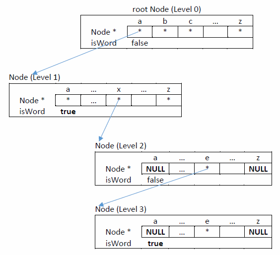
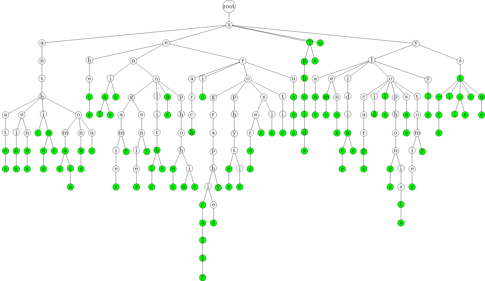
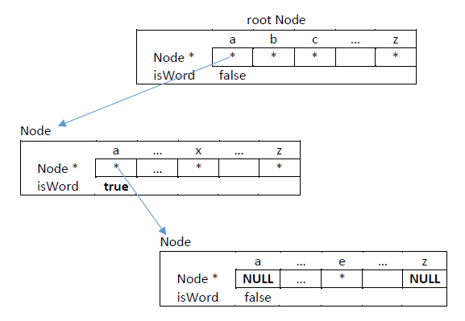
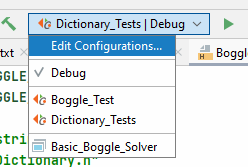
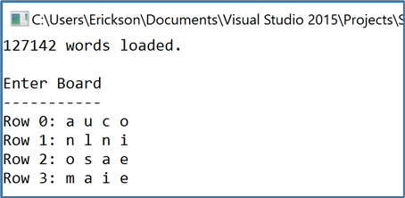
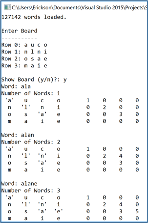
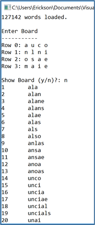
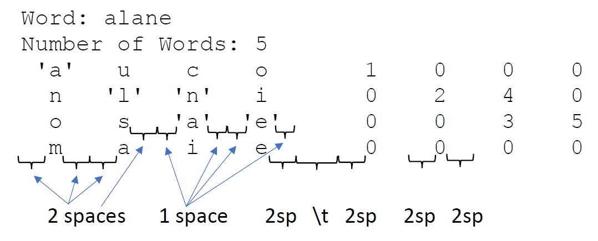
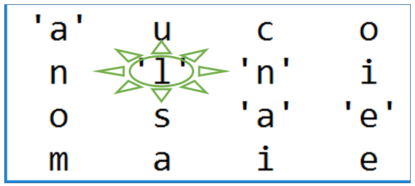

**START EARLY**.  I cannot stress this enough. On average it takes 5-7 days for 
students to complete the dictionary. The boggle solver can also take 5-7 
days. 

**Boggle solver cannot work with the Dictionary so be sure to make sure the 
Dictionary works before moving onto the Boggle solver.**

## Deliverables

| Deliverable                  | Points  |
| ---------------------------- | -------:|
| Dictionary_Tests             |  35     |
| Boggle_Tests                 |  30     |
| Questions                    |  15     |
| Commits                      |  10     |
| Commenting                   |  10     |
| **Total**                    | **100** |

The same standards for committing and commenting apply for this assignment 
as previous assignments. You should have pre/post comments in the header 
files at minimum as well as general comments.  You should also be committing 
and pushing regularly.

## Questions (3 pts/question)

1. The dictionary implementation given assumes each word is a lowercase letter 
   from "a" to "z".  Suppose you were to change the implementation of the 
   dictionary to include any unicode character.  How would you change the 
   `Node` definition to accommodate the extra characters?
   
   ```c++
   class Node {
    // Your answer here
   Node* letters[NUM_CHARS + newChars];
   bool isWord = false;
   Node()
   {
        int totalChars = NUM_CHARS + newChars
        for(int i = 0; i < totalChars; i++)
        {
            letters[i] = nullptr;
        }
   
   }
   };
   ```
   
2.  Suppose you use a binary search tree to store the words from the 
    `dictionary.txt` file. In the worse case scenario, how many comparisons 
    would it take to find out if a word is in the dictionary?
    
    > O(h) where h is the height of the tree

3.  Suppose you use a prefix tree to store the words from the `dictionary.txt` 
    file. In the worse case scenario, how many comparisons would it 
    take to find out if a word is in the dictionary using the `Dictionary` 
    class?
    
    > O(n) where n is the length of the word

4.  Why is the prefix tree better than a binary search tree for implementing 
    Boggle?

    > Prefix tree has an array of nodes making operation on this tree more efficient (better in time and space complexity)
> compared to a binary tree that can store one data type

5.  Suppose you do not use `IsPrefix` in your `SolveBoard` implementation.  
    How would that affect the program?

    > if not use then we will be doing unnecessary exploring prefixes that we know will not be a word

## Recommended Implementation Order

### Dictionary Class (Part A)

This is the recommend implementation order for the `Dictionary` class.

1.  `Dictionary()`
2.  `WordCount()`
3.  `AddWord(string word)`
4.  `IsWord(string word)`
5.  `IsPrefix(string word)`
6.  `LoadDictionaryFile()`
7.  `Dictionary(string filename)`
8.  `SaveDictionaryFile(string filename)`
9.  `MakeEmpty()`
10. `Dictionary(const Dictionary& otherDict)`    
11. `Dictionary& operator=(const Dictionary& otherDict)`

### Boggle Class (Part B)

This is the recommended implementation order for the `Boggle` class.

0. The `Dictionary` class needs to work!
1. `Boggle()`
2. `SetBoard(string board[BOARD_SIZE][BOARD_SIZE])`
3. `SolveBoard(printBoard, outfile)`/`SolveBoardHelper`

# Boggle Solver

The Boggle board is a 4x4 grid onto which you shake and randomly distribute 16 
dice. These 6-sided dice have letters rather than numbers, creating a grid of 
letters from which you can form words. In the original version, the players 
start simultaneously and write down all the words they can find by tracing by a 
path through adjoining letters. Two letters adjoin if they are next to each 
other horizontally, vertically, or diagonally. There are up to eight letters 
adjoining a cube. A grid position can only be used once in the word.  When time
is called, duplicates are removed from the players' lists and the players 
receive points for their remaining words based on the word lengths. In this 
assignment, you will be creating a program that will find all the words on a 
boggle board.  Any word found in the dictionary will count as a word on the 
boggle board.

> **Boggle Game:** https://www.youtube.com/watch?v=BJAdXnGAb7k

This assignment is broken into two parts. The first part of the program will 
be creating a dictionary that can be used to store and look up words.  This 
dictionary implementation will use a special tree called a prefix tree.

# Part A: Dictionary

To store the words in this assignment, you will be creating dictionary using 
a data structure called a prefix tree (also known as a Trie). This data 
structure allows for the  quick lookup of whether or not a word is valid. It 
will also allow you to find all words with a specific prefix. Rather than 
store each word individually, we instead store the words using a tree:



The example above shows two how the words "a" and "axe" are represented using a tree.

* Each node holds 26 pointers to other nodes; each of these nodes 
  corresponds to a specific letter.
* Each node also holds a single boolean flag.
* Essentially, each word is represented by a path down the tree.  
* If the path ends with a "false", then the path does not represent a valid 
  word.  
  
For example, the root node has a path from the first `Node*` pointer (i.e. 
the pointer representing 'a') to another `Node`.  Notice that this first level 
node has a "true" flag.  This indicates that "a" is a valid word. If we 
examine the pointer for the second level "x" position, we find that a path 
exists for "ax" to another node.  When we examine this second level node, we 
find that the pointer for the 'a' position is NULL.  This indicates that 
"aa" is not a valid word or prefix.  If we examine the pointer for the 'e' 
position, we see that another node exists.  When we look at this 3rd level 
node, we find that the flag for this position is true; this make sense since 
"axe" is a valid word. Notice that the 'a' Node pointer at the third level is
NULL; this means that there is no word with a prefix of "axea". Similarly, 
since the node for 'z' at the third level is NULL, this means there is no 
word with the prefix "axez".

> **HINT:** I highly suggest using the following tool to help you get 
> a feel for how the data structure works. 
> 
> https://www.cs.usfca.edu/~galles/visualization/Trie.html
 
> **Bigger Example:**
> This is an example of the prefix tree with all of the words starting with
> the letter x from the boggle dictionary. The green nodes indicates that
> the path to that node is a word. For example, "xebec" is a word.
> (See the trie_x.pdf in the readme_images folder for
> a higher resolution image).
>
> 

### Prefix

A prefix is a valid path down the tree.  A prefix may or may not be a valid 
word.  For the example below, "a" and "ax" are valid prefixes since there 
are words starting with these letters.  However, "aaa" is not a valid prefix.
This because the path ends with a NULL.

## `Basic_Dictionary.cpp`

The `Basic_Dictionary.cpp` can be used for development.  It will not be used 
for grading. I suggest using this program first before running the 
`Dictionary_tests`.  

> **Note:** This program is a CMake Application.  It will  not show up 
> as a Catch Application.
> 
> 



## `struct Node`

Your `Node` structure should contain an array of pointers.  The node can be 
a struct or class. The size of the array should be NUM_CHARS (ie 26). The 
struct/class should also contain a boolean flag called `isWord` to indicate 
if the path to this node represents a word.

> **HINT:** You may want to consider having a default constructor for your 
> node. This will decrease the amount of code you will need later.  You can 
> create a default constructor for a struct the same way you would for a class.


## `Dictionary() Default Constructor` 

The default constructor should establish a root node and make each 
position of the branch array null.  It should also set the root 
isWord to false. The total number of words should be 0.

> **Hint:** Having a default constructor for your node will reduce the code 
> required for this function and other functions.

## `Dictionary(const Dictionary& otherDict)`

The copy constructor should copy all of the contents of `otherDict` to `this`. 
You should use the `copyOther` function to accomplish this.

> **Hint:** Be sure to refer to the BinaryDictionaryTree example.

## `Dictionary& operator=(const Dictionary& otherDict)`

This overload should copy all of the contents of `otherDict` to `this`.  You 
should use the `copyOther` function to accomplish this.

> **Hint:** Be sure to refer to the BinaryDictionaryTree example.

## `copyOther(const Dictionary& otherDict)`

This function should copy all of the values from `otherDict` to `this` 
instance of the dictionary. It will serve as a wrapper for `copyHelper` 
in a similar way we recursively copied a binary tree in class.  The only 
difference is we have 26 children instead of two.  Here is a rough algorithm:

```c++
copyOther(const Dictionary& otherDict):
  Make this of the instance empty
  copy over the numWords from otherDict
    
  call copyHelper with the correct parameters
     
  return this instance
```

```c++
copyHelper(Node*& thisTree, Node*& otherTree):
    This code is very similar to a binary tree.
    The only difference is you need to copy 26 branches 
    instead of 2 branches (a for loop is helpful).
    Make sure you also copy the isWord parameter over too.
```

> **WARNING:** DO NOT JUST SET THE ROOTS EQUAL!
> 
> In other words, DO NOT do the following:
> 
> `root = otherDict.root;   // DON'T DO THIS!!!`
> 
> This will cause both dictionaries to share the same root!

## `void MakeEmpty()`

The `MakeEmpty` function should destroy all the nodes in the tree. After 
destroying all the nodes in the tree, the root should be remade and the 
number of words should be set back to 0.  `MakeEmpty` mainly serves as a 
wrapper function for the `destroyHelper`.  The `MakeEmpty` and 
`destroyHelper` functions work very similarly to the binary tree 
deconstructor covered in class.  The only difference is that you 
need to destroy 26 branches before deleting the current node. 

## `Dictionary(string filename)`

This constructor should establish a root node similar to the default 
constructor.  After that, it should open the file `filename` and add all the 
words in this file to the dictionary.

> **HINT:** There may be a function that you already wrote to help you with 
> this.  This constructor should have very few lines of code.

## `void LoadDictionaryFile(string filename)`

This function should open the file `filename` and add all the words in this 
file to the dictionary.  This function does *NOT* reset the words in the 
dictionary.  It just adds to the words already in the tree.

## `void SaveDictionaryFile(string filename)`

The `SaveDictionaryFile` function should use a recursive function to find 
every word in the tree and save it to a file.  This function mainly serves 
as a "Wrapper" for the `SaveDictionaryHelper` function.  The following is a 
rough algorithm:

```
SaveDictionaryFile(filename):
  Open the file
  if the file fails to open:
     throw a DictionaryError with the message filename+"failed to open"
  
  Call SaveDictionaryHelper with the appropriate arguments
```

> **HINT:** What should the prefix be at the root?  A path down the tree
> represents a word.  If you have a path that ends at the root node, what
> word does that represent?  Think about this when you set your prefix in
> the first call to `SaveDictionaryHelper` called in `SaveDictionaryFile`.

```
SaveDictionaryHelper(curr, currPrefix, outFile):
  Basecase (for you to figure out)
  
  if the current node represents a word
     output the word to the file
  
  for each letter:
     Call SaveDictionaryHelper with the appropriate arguments
```

> **HINT:** How should the prefix change in each call to 
> `SaveDictionaryHelper`? Be sure to look at how we tracked the path in the 
> maze example.  This strategy can also work here.

## `int WordCount()`

This function returns the total number of words in the dictionary.

## `void AddWord(string word)`

This method adds a word to the tree.  This is accomplished by reading the 
word character by character and creating a path in the tree for the word if it 
doesn't exist. Below is the pseudocode for this method:

```
currNode = root;
for (each character c of the word) {
   if  (the branch for character c is NULL) {
      set the branch of character c = new Node.
      set flag of this new Node to false
   }
   currNode = the pointer index of character c
}
Set the flag at the currNode to true
```

Here is some code that will help you loop through each character of a string.

```
// How to loop through each letter of a word
string str = "hello";
for (int i = 0; i < str.size(); i++) {
   cout << str[i] << endl;
}
```

While processing the characters, if you encounter a character that is not 
between 'a' and 'z', you should throw a `DictionaryError` with the message 
"Invalid character".  Uppercase letter would also be considered invalid 
characters since they would fall outside the 'a' - 'z' range. 

## `bool IsPrefix(string word)`

This method returns true if a path down the branches exists for a word. This 
method will have an implementation very similar to the AddWord method for 
traveling down the tree. It should return false if it runs into a NULL.  If 
it manages to get through the entire loop without hitting a NULL, it should 
return true.

While processing the characters, if you encounter a character that is not
between 'a' and 'z', you should throw a `DictionaryError` with the message
"Invalid character".

## `bool IsWord(string word)`

This method is very similar to the `AddWord` and `IsPrefix` method. If you have 
already implemented the `IsPrefix` method, then it should be fairly trivial to 
implement `isWord`. The main difference is you should return the `isWord` flag 
found of the node found at the end of the path.

While processing the characters, if you encounter a character that is not
between 'a' and 'z', you should throw a `DictionaryError` with the message
"Invalid character".

> **IMPORTANT:** The IsWord function checks to see if a path exists and 
> returns the isWord at the end of the path.

## IsPrefix versus IsWord

`IsPrefix` checks to see if at least one word in the dictionary starts with a 
particular prefix.  `IsWord` checks to see if a provided word exists in the 
dictionary.  A word will always be a prefix.  However, a prefix will not 
always be a word.

> **IMPORTANT:** A word is also prefix.

## Figuring out the index of a character

You will find it very useful to be able to figure out what index corresponds 
to a specific letter.

```
0 1 2 3 4 5 6 ... 25
a b c d e f g ... z
```

We can take advantage of the fact that characters can easily be cast into 
integers and use the following to figure out the index of a particular 
letter.  

For example, the following could be used to figure out the index of 
the character e:

`(int)'e' – (int)'a'`

The above would evaluate to the integer 4.

It is also easy to find the letter corresponding to an index using the same 
strategy.  For example, if you wanted to find the letter corresponding to 5 
(the letter 'f'), you can calculate:

`(char) (5 + (int)'a')`

Notice we cast the result as a character at the end (you may use any method 
you like for casting).

# Part B: Boggle Solver

Once you have completed and tested your Dictionary class, your next task is 
creating the Boggle solver. 

> **IMPORTANT:** It is strongly recommended you use the Basic_Boggle_Test 
> first to develop your Boggle program.  After you are confident that your 
> program is working properly, then you check your program using the other 
> Boggle tests.

## `Basic_Boggle_Solver.cpp`

The `Basic_Boggle_Solver` has some testing framework for you to use to 
help develop and debug the `Boggle` class.  A hard-coded board is provided 
as well as a function to get input from the user.

> **NOTE:** `Basic_Boggle_Solver` is not a Catch test application .  It will 
> appear as a CMake application, not a Catch application.
> 
> 

Here is a sample interaction using input from the user:



When solving the board, you have the option of printing out the board or not:

| **Show the board**  |  **Not showing the board**  |
:-------------------------:|:----------------------------:
| |   |

## `Boggle()`

The default constructor should initialize the `dict` with words from 
`dictionary.txt`.  It initialize each entry of `board` to the 
empty string.  It should also initialize each entry of `visited` to `false`.

## `Boggle(filename)`

This constructor should initialize the `dict` with words from
`filename`.  You should use `AddWord` or `LoadDictionaryFile` to help you do 
this. It should also initialize each entry of `board` to the empty string.  It 
should also initialize each entry of `visited` to `false`.

## `SetBoard(string board[BOARD_SIZE][BOARD_SIZE])`

This function should copy each entry of `board` to `this->board`.

> *WARNING:* Do not just set `this->board = board`.  This results in a 
> shallow copy. 

## `PrintBoard(ostream& output)`

One of the requirements of the program is that the solver should also show 
the path of the solution.  For the example below, we can see how "alane" is 
found using the grid on the right.



The `PrintBoard` function should print out the in the same format as the 
above output. This function should be used by the `SolveBoardHelper`.

Use the `visited` matrix to figure out when to print the quotes 
around the letter.  You should print a quote if the `visited` matrix is 
not 0 at a given position.

> **HINT:**  
> It may be helpful to print each letter with two spaces in the 
> front and two spaces in the back:  
> 
> `"  m  "`  (two spaces in front, two spaces at back)
> 
> If the letter has a quote, then it should print a single 
> space in the front and back:
> 
> `" 'm' "` (one space in front, one space at the back)
> 
> You can always look in the `test_data` at a solve_output_print_#.txt file 
> to see the formatting.

## `void SolveBoard(bool printBoard, ostream& output)`

This method finds all the words on the current board stored by `board` and 
saves these words to the `wordsFound` dictionary.  The function also outputs 
the values to the `output` `ostream` object.  This `ostream` can be called 
with `cout` or an `ofstream` object (see provided code in `Boggle_Solver.cpp`).
The `SolveBoard` method serves mainly as a wrapper function for the 
`SolveBoardHelper` method. This function should reset the `wordsFound` 
dictionary each time it is run.

## `void SaveSolve(filename)`

This should use the `SaveDictionaryFile` for the wordsFound.

### Recursion Strategy

A straightforward strategy to finding all the words on the board is to use 
recursive backtracking. The general idea is to start at each position and 
then explore all paths originating at that position being careful not to 
re-visit grid positions.

The solution will start with the `SolveBoard` function.  `SolveBoard` will serve 
as a "wrapper" for another `SolveBoardHelper` function that will do the heavy 
lifting of the recursion:

```c++
For each position on the board
    Find all of the words on the board starting at this position
```

In terms of the algorithm, this will be writen as:

```c++
For each position on the board
	Call SolveBoardHelper starting at the current board position
```

The job of `SolveBoardHelper` is to ***recursively*** check the 
surrounding 8 positions.  



I suggest thinking about the base case(s) first. Be sure to make use of the 
`isPrefix` method to prevent exploration of paths that will not produce words.

> **NOTE:** A solution using this strategy is very short (solutions are
> about 40 lines or less). If you find yourself writing lot of code, you may 
> want to rethink your strategy.

Each call to `SolveBoardHelper` function will require multiple variables in 
order to complete its task:

*	What row and col to start
*	What the current step is (see previous diagram for Board Printing)
*	A string that stores the current prefix/path on the board
*	A way to remember all the previously visited spaces
*	A way to remember words you have already found
*   The ostream object to output results

I strongly suggest you use a debugger or use a generous number of `cout`
statements to help you debug.

To get the same output order as the provided
test output, you should search in the following order:

* North
* Northeast
* East
* Southeast
* South
* Southwest
* West
* Northwest

> **HINT:** Be sure to review the maze example that go over in class.  
> This example provides a strategy that is very close to what you need for this 
> function.
